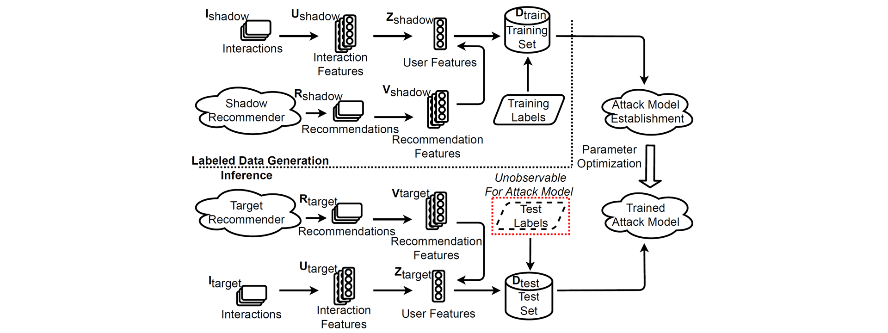

## Membership Inference Attacks Against Recommender Systems

__Minxing Zhang__, Zhaochun Ren, Zihan Wang, Pengjie Ren, Zhumin Chen, Pengfei Hu, Yang Zhang

_ACM Conference on Computer and Communications Security (CCS) 2021_

---



---

### Introduction

There are two .py files which are our attack models.
One is based on a clustering algorithm. And the other is based on the deep learning technique.

And there are three types of datasets, i.e., "Interactions", "Recommendations" and "Vectorizations".
- "Interactions" is formatted as: ``UserID`` ``\t`` ``ItemID`` ``\t`` ``Scores`` ``\n``
- "Recommendations" is formatted as : ``UserID`` ``\t`` ``ItemID`` ``\t`` ``Scores`` ``\n``
- "Vectorization" is formatted as: ``Vector[i][1]`` ``\t`` ``Vector[i][2]`` ``\t`` ... ``\t`` ``Vector[i][m]`` ``\n`` (Here, $m$ is the dimension of the feature space, and $i$ means this feature vector corresponds to the $i^{th}$ user.)

Note that, to balance data, the first half of Interactions and Recommendations are for Members while the second half of them are for Non-Members.

Here, we will provide the guidelines to construct datasets for the attack:

Datasets for "Interactions" are derived following the steps:
1. To randomly divide the original dataset into 3 subsets for Shadow Model, Target Model, and Vectorization.
2. For each subset, filter the users with less than 20 records.
3. To relabel users and items by consecutive numbers.
4. To store records using the above format and to sort them by user number.

Datasets for "Recommendations" are derived from corresponding recommendation systems (Item-based Collaborative Filtering, Latent Factor Model, or Neural Collaborative Filtering), which are stored in the above format.
- Item-based Collaborative Filtering aims to find the similarities among items, which is based on the user behavior on items. For instance, if a user bought item A and item B at the same time, the items A and B are more related. Then, according to the calculated similarities, the recommender systems could provide users with items most relevant to what they have interacted with.
- Latent Factor Model aims to find latent factors that can represent both item attributes and user preferences. Specifically, the user-item matrix is decomposed into two lower-dimensional matrices. This lower-dimensional space is composed of latent factors (as bases). In that case, the predicted preferences of users to items are the product of these two matrices, so that recommender systems can easily select recommendations for users.
- The implementation of Neural Collaborative Filtering follows [this work](https://dl.acm.org/doi/pdf/10.1145/3038912.3052569?casa_token=owaGUwOEa8wAAAAA:QAbweAuMvQdJOv0z-qtu088piamaj0tiN2TGqdRlvnRrN3uGw6H95KkPDach7eBFd8ou5Tpd9A0Y).

Datasets for "Vectorization" are derived following the method in the paper.

### Dataset Construction

The implementations of dataset construction can be found [here](https://github.com/WZH-NLP/DL-MIA-KDD-2022/blob/main/DATASET.md).

### Reference

To acknowledge the use of our work, please cite our paper:

```
@inproceedings{DBLP:conf/ccs/ZhangRWRCHZ21,
  author       = {Minxing Zhang and
                  Zhaochun Ren and
                  Zihan Wang and
                  Pengjie Ren and
                  Zhumin Chen and
                  Pengfei Hu and
                  Yang Zhang},
  editor       = {Yongdae Kim and
                  Jong Kim and
                  Giovanni Vigna and
                  Elaine Shi},
  title        = {Membership Inference Attacks Against Recommender Systems},
  booktitle    = {{CCS} '21: 2021 {ACM} {SIGSAC} Conference on Computer and Communications
                  Security, Virtual Event, Republic of Korea, November 15 - 19, 2021},
  pages        = {864--879},
  publisher    = {{ACM}},
  year         = {2021},
  url          = {https://doi.org/10.1145/3460120.3484770},
  doi          = {10.1145/3460120.3484770},
  timestamp    = {Tue, 19 Sep 2023 16:49:28 +0200},
  biburl       = {https://dblp.org/rec/conf/ccs/ZhangRWRCHZ21.bib},
  bibsource    = {dblp computer science bibliography, https://dblp.org}
}
```
